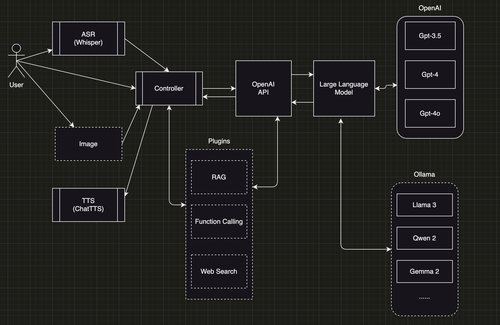

# gtpshell

This is a simple chatbot shell application which is able to connect to any llama model. It supports speech recognition and text-to-speech.



## Installation

## Dependencies

- Python 3.10 or higher
- OpenAI 

> pip install -r requirements.txt

## TTS (ChatTTS)

- Install

```bash
$ mkdir modules
$ cd modules
$ git submodule add https://github.com/2noise/ChatTTS.git
```

- Build

Have to run `poetry shell` first. 

```bash
$ cd ChatTTS
$ pip install -r requirements.txt
```

## How to run the application

- Add a environment file in project's root folder. The application will take default file name as '.openai.env'.
- Add the following environment variables to the `.env` file as an example.
```
OPENAI_API_KEY="mykey"
OPENAI_BASE_URL="http://localhost:11434/v1"
DEFAULT_MODEL="qwen2"
```
- Run the application

```bash
$ python gptshell <you env file>
```

> If you have an .openai.env and want to use it. You can simply run `python gptshell`

## Distribution

Use PyInstaller to create a standalone executable.

> pip install pyinstaller

```python
$ pyinstaller -F gptshell/__main__.py
```

The standalone executable will be created in the dist folder.

TODO: Is it possible to distribute to mobile?

## Run

- Goto poetry shell environment

```bash
$ poetry shell
$ python gptshell
```

## Issues

Unable to install `openai-whisper` by using `poetry add`. So install it through `pip install` in `poetry shell` environment.

## TODO

- Add a logger for debug only
- Refactor to use type
- Support such as Function Calling, RAG etc
- Develop a plugin system to support such as web search etc
